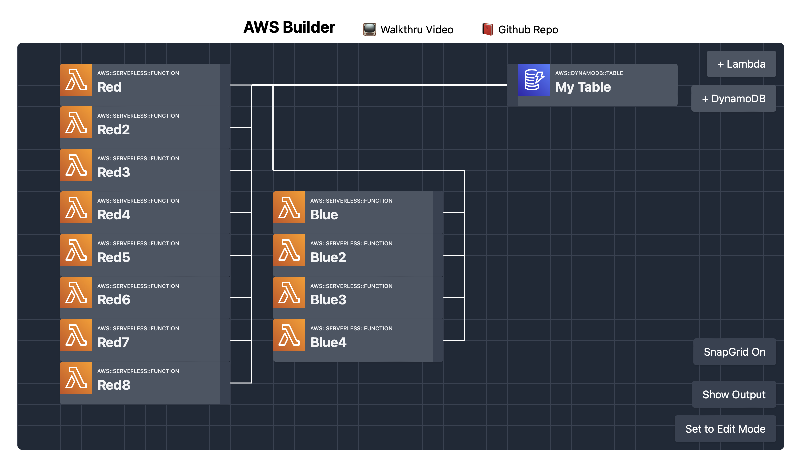

# Builder

-   Demo: https://builder.garyjennings.ca
-   Video Walkthru: https://www.loom.com/share/660be7692054433c9877a9588ba80bf0

## Example App

Currently only Lambda and DynamoDB are implemented and generating CloudFormation, and only the lines between Lambda and DynamoDB are influencing how the CloudFormation is built. The other resources shown below were added to demonstrate how a more complete app might look once these resources are fully implemented.

